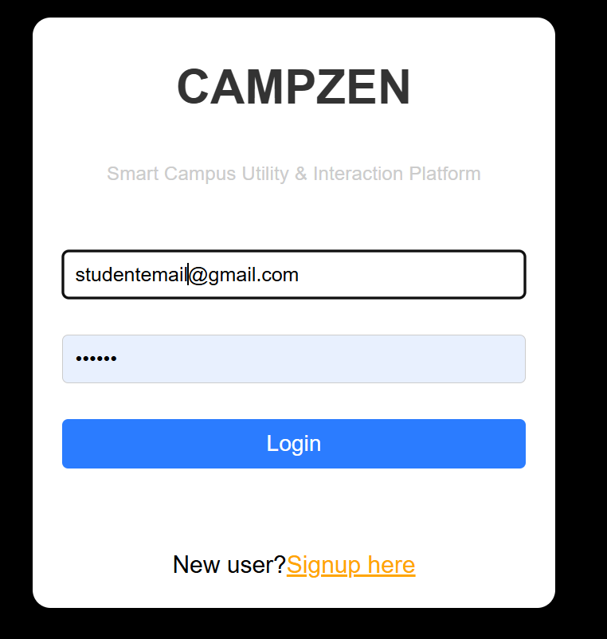
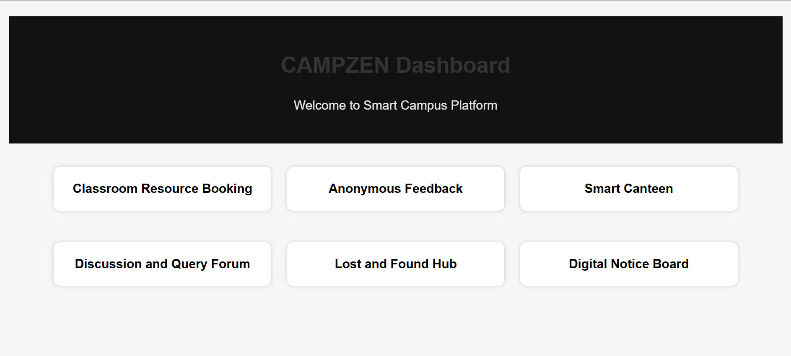
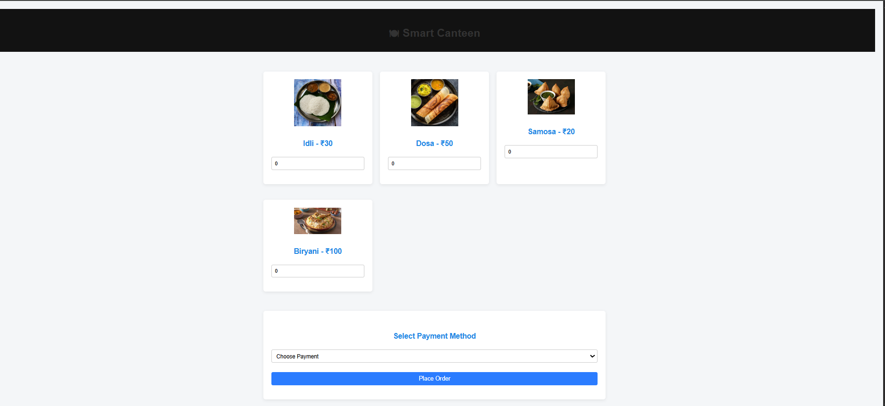

# CAMPZEN

A Smart Campus Utility & Interaction Platform built using Flask, MySQL, HTML, CSS, and JavaScript.

## Features

- User Registration & Login
- Classroom & Lab Booking System
- Real-Time Slot Availability Checking
- Smart Canteen Menu & Cart Management
- Discussion & Query Forum
- Digital Notice Board
- Lost & Found Hub
- Anonymous Feedback System
- MySQL Database Integration
- REST API-Based Booking Operations

## Technologies Used

### Frontend
- HTML
- CSS
- JavaScript

### Backend
- Python
- Flask

### Database
- MySQL

### Tools
- Git
- GitHub
- VS Code

## Screenshots

### Login Page

### Dashboard

### Classroom & Lab Booking

### Smart Canteen

## Author

Ashmitha

